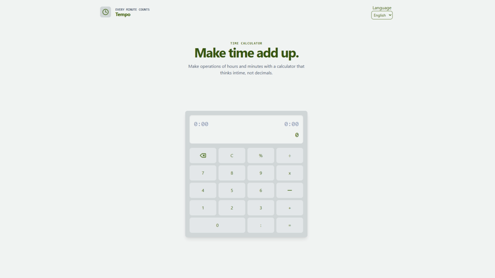

# ⏱️ Tempo

**A calculator that thinks in time, not decimals.**

Add, subtract, multiply, and divide hours and minutes directly — no more converting `1:45 + 2:30` into decimals and back. Tempo handles `HH:mm` math natively, wraps overflow into days, and speaks your language.

<p align="center">
  
  
  
  
</p>

---

> 🌐 **Live demo:** hosted right here via GitHub Pages — `https://exatoon27.github.io/Tempo/`

## ✨ Features

- 🕐 **Time-native arithmetic** — operate on `H:mm` values, not fractional hours
- ➕➖✖️➗ **Full operator set** — addition, subtraction, multiplication, division, and percentage
- 📅 **Day overflow** — results past 24h automatically show as `HH:mm (+Xd)`
- ➖ **Negative time support** — signed values and sign toggling
- ⌨️ **Full keyboard support** — type digits, operators, `:`, `Enter`, `Backspace`, `Esc`
- 🌐 **Built-in i18n** — English and Spanish out of the box, driven by simple JSON files
- 🪶 **Zero build step** — plain HTML/CSS/JS, open `index.html` and go

## 🖥️ Preview



## 🚀 Getting Started

No build tools, no `npm install` — just static files.

```bash
git clone <this-repo>
cd tempo
```

Then serve it with any local static server (the app fetches language files, so plain `file://` won't work for translations):

```bash
# Python
python -m http.server 8000

# Node
npx serve .
```

Open **<http://localhost:8000>** and start calculating.

## 🧮 Usage

| Input          | Meaning                             |
| -------------- | ----------------------------------- |
| `1:30`         | 1 hour 30 minutes                   |
| `90`           | 90 minutes (no colon = raw minutes) |
| `-2:15`        | negative 2 hours 15 minutes         |
| `2:00 × 3`     | scales a duration                   |
| `10:00 ÷ 4`    | splits a duration                   |
| `40:00` result | displays as `16:00 (+1d)`           |

### ⌨️ Keyboard shortcuts

| Key             | Action           |
| --------------- | ---------------- |
| `0`–`9`         | digits           |
| `:`             | separator        |
| `+` `-` `*` `/` | operators        |
| `%`             | percentage       |
| `Enter` / `=`   | equals           |
| `Backspace`     | delete last char |
| `Esc`           | clear            |

## 📁 Project Structure

```
tempo/
├── index.html          # markup + Tailwind styling
├── lang/
│   ├── langs.json       # list of available languages
│   ├── en.json           # English strings
│   └── es.json           # Spanish strings
└── scripts/
    ├── calc.js          # Calculator engine (time parsing & arithmetic)
    ├── buttons.js       # UI wiring — button clicks & keyboard events
    └── lang.js          # i18n loader & language switcher
```

## 🧠 How the engine works

`Calculator` (in [scripts/calc.js](scripts/calc.js)) keeps every value internally as **minutes**:

1. `timeToMinutes(time)` parses `HH:mm` or plain-minute strings into a number
2. Operations accumulate against a running total (`accumulator`)
3. `minutesToDisplay(totalMin)` formats minutes back into `HH:mm`, wrapping into `(+Xd)` when the result exceeds 24 hours

This keeps arithmetic exact — no floating-point decimal-hour rounding errors.

## 🌍 Adding a language

1. Create `lang/<code>.json` with the same keys as [lang/en.json](lang/en.json)
2. Add `{ "code": "<code>", "name": "<Display Name>" }` to [lang/langs.json](lang/langs.json)

The language selector and `data-i18n` bindings pick it up automatically.

## 🗺️ Roadmap

- [ ] Calculation history panel (button already in the header, awaiting implementation)
- [ ] Dark Mode

## 📄 License

[MIT](LICENSE.md) — do whatever you want, just keep the copyright notice.
